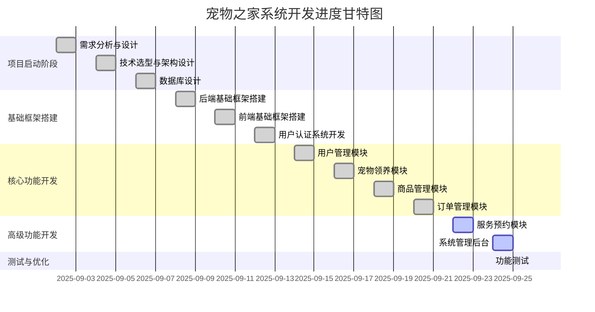

# 宠物之家系统 - 项目进度计划甘特图

## 📅 项目时间轴（4周开发周期）

## 📋 详细开发计划

### 第1周第1-2天：项目启动阶段
**时间**: 2025-09-02 ~ 2025-09-03
**负责人**: 产品经理 + 全团队
**主要任务**:
- 需求调研与分析
- 技术架构设计
- 开发环境搭建

**交付物**:
- 需求规格说明书
- 技术架构文档

### 第1周第3-4天：技术选型与数据库设计
**时间**: 2025-09-04 ~ 2025-09-07
**负责人**: 后端开发工程师 + 数据库工程师
**主要任务**:
- 技术选型确认
- 数据库表结构设计
- 数据库初始化脚本

**交付物**:
- 完整数据库建表SQL
- 数据库文档

### 第2周：基础框架搭建
**时间**: 2025-09-08 ~ 2025-09-13
**负责人**: 全体开发人员
**主要任务**:
- SpringBoot项目初始化
- Vue3项目初始化
- 用户认证系统开发
- 公共组件开发

**交付物**:
- 后端基础框架
- 前端基础框架
- 用户认证模块

### 第3周：核心功能开发
**时间**: 2025-09-14 ~ 2025-09-21
**负责人**: 全体开发人员
**主要任务**:
- 用户管理模块
- 宠物领养系统
- 商品管理系统
- 订单处理系统

**交付物**:
- 核心业务模块
- 前端业务页面

### 第4周前3天：高级功能开发
**时间**: 2025-09-22 ~ 2025-09-25
**负责人**: 分模块开发
**主要任务**:
- 服务预约系统
- 系统管理后台完善
- 功能集成调试

**交付物**:
- 服务预约模块
- 完整后台管理功能

### 第4周最后1天：功能测试
**时间**: 2025-09-26
**负责人**: 全体开发人员
**主要任务**:
- 功能测试
- Bug修复
- 系统验收

**交付物**:
- 测试报告
- 功能完整的系统

## 🎯 关键里程碑

| 里程碑 | 时间       | 描述                       |
| ------ | ---------- | -------------------------- |
| M1     | 2025-09-03 | 项目启动完成，技术架构确定 |
| M2     | 2025-09-07 | 数据库设计完成             |
| M3     | 2025-09-13 | 基础框架搭建完成           |
| M4     | 2025-09-21 | 核心功能开发完成           |
| M5     | 2025-09-25 | 高级功能开发完成           |
| M6     | 2025-09-26 | 功能测试完成               |

## ⚠️ 风险控制

### 技术风险
- **风险**: 新技术学习成本
- **应对**: 提前技术预研，快速上手

### 进度风险
- **风险**: 功能开发超期
- **应对**: 每日进度评审，及时调整资源

### 质量风险
- **风险**: 代码质量不达标
- **应对**: 代码评审机制，实时测试

### 人员风险
- **风险**: 关键人员缺席
- **应对**: 知识共享，交叉培训

## 📊 资源分配

### 开发资源
- **产品经理**: 需求管理、项目协调
- **后端开发**: 2人，负责服务端开发
- **前端开发**: 1人，负责前端界面开发
- **数据库工程师**: 1人，负责数据库和后台管理

### 时间分配
- **基础框架**: 25%
- **核心功能**: 50%
- **高级功能**: 20%
- **测试优化**: 5%

---

*该甘特图展示了宠物之家系统的4周开发周期，确保项目在有限时间内高质量交付可测试系统。*